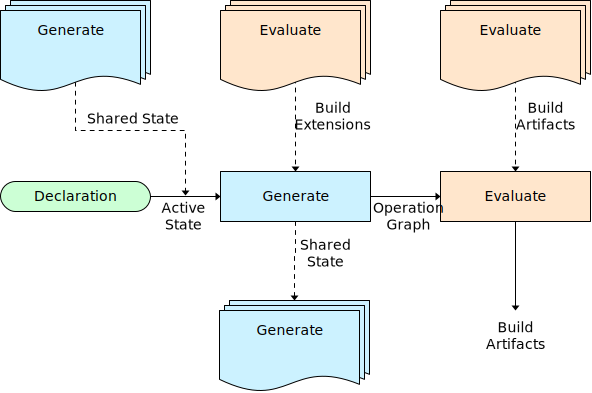

# Architecture

## Overview
The **Soup** build system utilizes a three phased approach to building code. A **declarative** frontend that tells the build **what** to build. A **generate** layer then defines **how** to build the requested definition. And finally, the **evaluate** engine **runs** the build.

## Declaration
There are four ways to declare the state for an invocation of a build. Through the command line application, from the Recipe file for each package, from a Root Recipe file that is shared with packages in the same folder hierarchy and from the global user config. All input state is combined into a single [Active State Table](Architecture/Active-State-Table.md) which is consumed by the Generate Phase.

### Application
The [Command Line Interface (CLI)](CLI.md) is the first thing a user will see when they interact with the Soup build system. The CLI is primarily there to take user input through a set of parameters and flags to pass temporary configuration values into the build execution. The command parameters will be used to generate a unique output folder for the given build to allow for individual builds to coexist for the same package (i.e. Release vs Debug). The argument properties will be combined with a set of generated properties from the application that are passed into the next phase of the build through a [Parameters Table](Architecture/Parameters-Table.md).

### Recipe
The build definition will use a declarative **Recipe** configuration file is how the user will configure their project. The Recipe file will utilize the [toml](https://github.com/toml-lang/toml) language (and possibly a custom config language in the future) as a clean, human readable, configuration definition that supports a core set of data types. The file can be thought of as a simple property bag for setting shared parameters into the build system for an individual package.

There are a few "known" property values that will be used within the build engine itself; however, the entire contents will be provided as initial input to the build engine.

### Root Recipe
When processing the state for a given Recipe file the system will walk up the directory structure for the first instance of a [Root Recipe](Architecture/Root-Recipe.md). This file is used as a shared set of properties that can be used by multiple packages.

### Local User Config
The [Local User Config](Architecture/Local-User-Config.md) allows the user to specify external SDK definitions that will grant read access to the specified folders and pass in the shared state to the build.

## Generate
The Generate Phase takes the combined input Declaration along with the [Shared State](Shared-State-Table.md) Generated from the dependencies and generates the [Operation](Build-Operation.md) Graph that will be passed to the Evaluate phase, along with the output Shared State that downstream dependencies will consume.

All build logic is injected into the Generate phase through the [Build Extension](Build-Extension.md) framework. Each build extension is simply a C# library package that contains one or more public implementations of the `IBuildTask` interface. When referenced from the another Recipe as a **Build** dependency the Generate Engine will user reflection to discover and instantiate all instances of the build tasks. Each build task contains of a set of run before and after lists that instruct the Generate Engine in what order to run the tasks to ensure shared state is setup in the correct order. The tasks then invoke their single Run method that will allow them to read and write from the active and shared state and generate build Operations.

Along with the list of explicit Build dependencies that inject build extensions, the **Language** property also instructs Soup to add the default tasks for that language.

## Evaluate
The final stage of the build is to evaluate the build Operations that were generated from the build Tasks. These commands contain the executable and arguments to pass in, as well as the input and output files that will be used to perform incremental builds. During execution of each Operation the Engine will monitor the actual file system access to build a complete set of input and output files to be used for a guaranteed incremental build. The initial implementation will use a very simple time-stamp based incremental build that can be extended to use hashing of file contents in the future.

## Detailed Flow

The build Engine is responsible for recursively building all transitive dependencies, facilitating the registration and execution of build Tasks, and evaluating all requirement build Operations. All build logic will be contained in Tasks and all build execution will be performed in Operations. Having this extra layer of separation between the build generate and the build evaluate allows for build Extensions to get fast incremental build support for "free" and will allow for future performance improvements without introducing breaking changes into the Extension Framework itself. This means **Soup** can support super fast builds for any possible unique build step or even be extended to support any language by only writing a new default build Extension layer.

This work can be broken down into five phases:
1. **Initialize Global State**
    * The Local User config is read from disk. 
    * Command line arguments are placed in the Parameters table. Generate unique output folder for this build configuration.
    * Default parameters are set for "Build" dependencies. This allows the build runtime to be different from the target of the build itself (ie. building for Debug/Linux, while using Release/Windows.) Generate unique output folder for this build configuration.

1. **Parse Declaration**
    * The Recipe toml file is read from disk and parsed into a property bag.
    * Search for a Root Recipe file, and read from disk if present. Update the output directory if specified.

1. **Build Dependencies** -
    * The Engine will use the known property lists "Dependencies" to recursively build all transitive dependencies starting at phase two.
    * Set the Dependencies table entry for in the parameters table for each build.

1. **Build Generate**
    * Write Parameters Table file to disk.
    * Perform incremental Generate check to see if input has changed and requires re-generating the build. Leverage same incremental build logic as Evaluate to monitor input/output files. Will include Extension DLLS, Parameters Table file, Recipe file, Shared State files from Dependencies.
    * Discover all Build Extension Tasks using scanning the explicit "Build" dependency libraries and the implicit "Language" default build extension for public implementations of the `IBuildTask` interface.
    * Instantiate each class using dependency injection to pass in extra functionality (i.e. Logger, etc)
    * Using the Before/After lists invoke each build Task in their requested order.
    * Save Shared State and Operation Graph to disk.

1. **Build Evaluate** -
    * Walk the Operation Graph and invoke each operation in the required order to ensure files generated as output are finished before being consumed as input.
    * Monitor the actual file system access (using Detours on Windows, open question for other platforms) to verify the declared input/output files match reality.

## Package Manager
You may have noticed that nothing about the build explicitly deals with the integration of a public feed of packages. Because each individual projects build is isolated and self contained, a dependency [Package Reference](Package-Reference.md) can easily be migrated from a directory reference, for local projects, to a name@version pair that will be resolved to a published snapshot of a public project. The CLI application will consume a rest API from a hosted web service that allows for users to install other projects and publish the code they would like to share with ease. The build Engine will then have a small amount of integration logic that knows where to look when resolving dependencies that reference a public package that will be installed to a known location. It should be noted that these public dependency references can be for both runtime and developer dependencies. This will allow for shared packages to contain custom build logic and for the creation of shared build Extensions to augment the built in build Tasks.

## Open Questions
* Find replacement for Windows Detours on Linux and macOS.
* "Top level incremental builds" - We can be faster!!! In the design for the [tup build](http://gittup.org/tup/build_system_rules_and_algorithms.pdf) system they define what they call **Beta Build Systems** which rely on the inverse lookup of taking the known changed files to lookup which build steps need to be rerun. This may not be enough for Soup since there is a decent amount of work to be done during Generate which does not involve the Operation calls. I would like to adapt this design to track the exhaustive set of files used for a given package to implement a top level incremental build that can skip all packages that are not changed. It will require a daemon to monitor file access between calls, but it will be worth it for large projects.