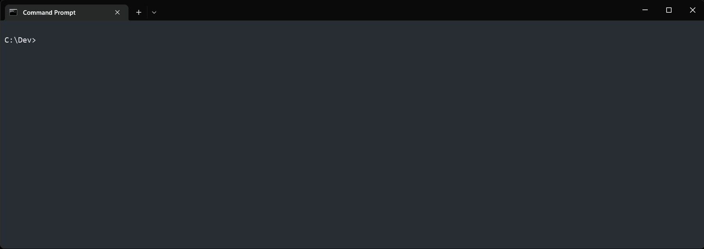
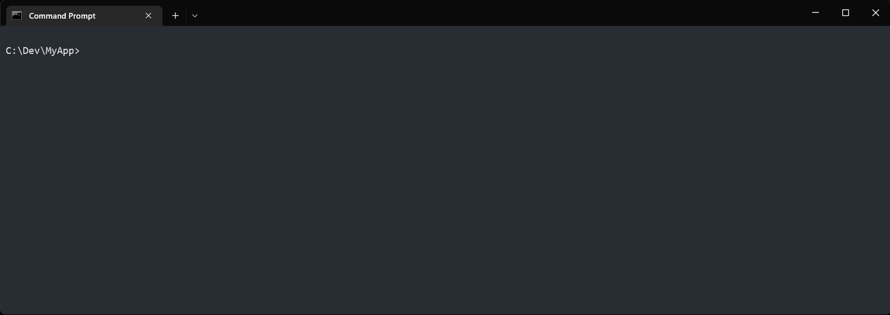

# Getting Started
The end goal is to have Soup running on all three major operating systems, and building for any target. However, there is a heavy dependency on C++20 Modules which has had the best luck on the latest MSVC compiler, so we currently only support Windows development.

## Requirements
* Windows 10
* Build Tools
  * [Visual Studio 2022](https://visualstudio.microsoft.com/downloads/) with "Desktop development with c++" workload.
  * OR
  * [Build Tools For Visual Studio 2022](https://visualstudio.microsoft.com/downloads/#build-tools-for-visual-studio-2022) with "c++ build tools" workload.
* [Latest Release](https://github.com/SoupBuild/Soup/releases/latest)

## Setup
You can either install Soup or download a reference the archive.

* Installer

  Download and run the SoupBuild.msi installer from the [Latest Release](https://github.com/SoupBuild/Soup/releases/latest). 

  Note: The installer is signed signature may not be trusted yet and you will have to ignore some scary warnings. When Microsoft receives enough trusted notifications this will no longer be necessary. 

* Archive

  Download the SoupBuild.zip archive from the [Latest Release](https://github.com/SoupBuild/Soup/releases/latest). 

  Unzip the Soup release somewhere safe and add it to your path in a command prompt.

  ```
  set PATH=%PATH%;C:\Soup\bin\
  ```
  Or add it to the "Path" System Environment Variable to always have it available!

## Setup SDKs
Use the SWhere tool to find the latest installed version of the SDKs on your local machine (listed in the dependencies list).

```
swhere
```


## Create First Project
Run Initialize command to create a new project!
```
mkdir MyApp
cd MyApp
soup init
```


## Build First Project
```
soup build
```



## Run First Project
```
soup run
```


## Enjoy!
Check out the other [Samples](./Samples.md).
